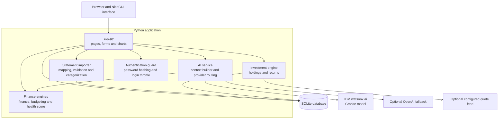

# Vizier

Vizier is an Ethiopian personal-finance intelligence prototype created for IBM Dev Day. It helps individuals organize monthly finances, import statements, understand their financial health, track goals and assets, and ask an educational AI coach questions grounded in calculated financial data.

The project uses Ethiopian birr (`ETB`) by default and includes synthetic Ethiopian transaction data for demonstrations.


## Why the name Vizier?

Historically, a vizier was a trusted adviser who helped a ruler interpret complex information and make informed decisions. Personal finance creates a similar problem on a smaller scale: income, expenses, debts, goals and investments produce plenty of data but rarely provide a clear decision.

Vizier takes its name from that advisory role. The application does not try to replace the user’s judgment or act as an autonomous financial authority. It organizes the available information, performs reproducible calculations and explains what the figures may mean so that the user can make a better-informed decision.

The black-and-gold identity reflects the same idea. Gold represents value and stewardship, while the dark interface gives the application a restrained, analytical character.

## What Vizier can do

- Create a local account and maintain separate financial accounts
- Record income, expenses and monthly savings targets
- Track category budgets, savings goals and debts
- Compare monthly spending and savings trends
- Import CSV statements with configurable column mapping
- Categorize transactions and prevent duplicate imports
- Calculate an explainable financial-health score
- Track a portfolio of Ethiopian reference assets
- Screen suspicious messages using deterministic scam indicators
- Answer financial questions with IBM watsonx.ai and Granite, OpenAI, or an offline rules engine
- Export saved financial history as CSV

## How it works

### 1. Capture

The user records a monthly plan or imports a bank or mobile-money statement. The statement importer detects common column names, lets the user correct the mapping, validates dates and amounts, and rejects malformed rows.

### 2. Normalize

Imported transactions are converted into a consistent internal format. Vizier assigns categories through deterministic keyword rules and calculates a stable fingerprint for each transaction. The fingerprint prevents the same transaction from being imported repeatedly.

### 3. Store

The persistence layer writes user profiles, financial accounts, monthly records, transactions, budgets, goals, debts, holdings and watchlists to SQLite. Every user-owned query includes the user identifier. Foreign-key constraints remove dependent records when a user or account is deleted.

### 4. Calculate

Python modules calculate expenses, savings, savings rate, budget status, emergency-fund coverage, portfolio returns and the financial-health score. These calculations remain deterministic and testable. The language model does not calculate the financial figures.

### 5. Explain

The AI service builds a limited context from the calculated results. When IBM credentials are configured, Vizier obtains a short-lived IBM Cloud IAM token and sends that context to a Granite model through watsonx.ai. OpenAI can serve as a secondary provider. If neither service is available, the offline coach still produces rule-based guidance.

Raw uploaded statement files are parsed locally and are not sent to either AI provider.

### 6. Present

NiceGUI renders the results as a responsive black-and-gold dashboard. The interface includes monthly metrics, charts, health-score components, portfolio allocation, statement history and a persistent dark-mode preference.

## Application architecture



### Components

| Component | Responsibility |
|---|---|
| `app.py` | NiceGUI pages, navigation, inputs, charts and feature integration |
| `database.py` | SQLite schema, parameterized queries and user-scoped persistence |
| `finance.py` | Income, expense, savings and savings-rate calculations |
| `budgeting.py` | Category limits, monthly comparisons and emergency-fund coverage |
| `health_score.py` | Explainable financial-health score and recommendations |
| `statement_import.py` | CSV parsing, column detection, validation, categorization and fingerprints |
| `investments.py` | Holding-level and portfolio-level return calculations |
| `market_data.py` | Optional quote retrieval, five-minute cache and labelled demo fallback |
| `ai_service.py` | Financial context construction and AI-provider routing |
| `auth_security.py` | Process-local failed-login tracking and temporary lockout |
| `settings.py` | Country, currency, environment and production-secret validation |

### Data architecture

SQLite stores the prototype data in these related groups:

- Identity: users and financial accounts
- Planning: monthly records and category budgets
- Goals and liabilities: savings goals and debts
- Investments: holdings and watchlists
- Statements: import batches and normalized transactions

SQLite is deliberate prototype infrastructure, not a production claim. A multi-instance deployment should replace it with PostgreSQL, versioned migrations and encrypted managed storage.

### AI trust boundary

Vizier separates calculation from explanation:

```text
User data
    -> deterministic Python calculations
    -> limited financial context
    -> configured AI provider
    -> educational explanation
```

This prevents a language model from silently inventing balances, returns or health-score components. AI responses remain educational and must not be treated as financial or investment advice.

## Repository contents

- `vizier-app/`: application source, tests, sample data and deployment configuration
- `Vizier-Ethiopia-Presentation.pptx`: editable project presentation
- `Vizier-Ethiopia-Presentation.pdf`: presentation preview
- `README-checklist.md`: supplied launch-planning reference
- `README-vulnerability.md`: supplied security-assessment reference

## Run the application

```bash
cd vizier-app
python3 -m venv .venv
source .venv/bin/activate
pip install -r requirements.txt
cp .env.example .env
python app.py
```

Open <http://localhost:8080>. No AI credentials are required for the offline demo.

For a prepared demonstration, import:

```text
vizier-app/sample-data/ethiopia-statement.csv
```

Configuration instructions for IBM watsonx.ai, containers and production mode are available in [the application README](vizier-app/README.md).

## Test

```bash
cd vizier-app
python -m unittest -v
```

The current suite contains 31 tests covering calculations, persistence, statement processing, duplicate handling, market fallbacks, AI rules and security configuration.

## Contributors

Add each contributor’s name, GitHub profile and primary responsibility before submission.

| Contributor | GitHub |
|---|---|
| _Benson Gikonyo_ | _@Benson-Gikonyo_ |
| _Daniel Waithaka_ | _@dante1-dev_ |
| _Joel Mugendi_ | _@JoelMugendi_ |
| _Peter Makori_ | _@PeterMaks_ |
| _Patience Karanjah_ | _@nimo731_ |

## Product boundary

Vizier is not a bank, lender, broker, payment processor or regulatory-reporting platform. It does not connect to telebirr, move money, execute trades, collect national identity numbers or submit reports to the National Bank of Ethiopia.

The accompanying launch and vulnerability documents describe controls that would become relevant if the product later entered regulated payments or lending. They are planning references, not evidence of certification, regulatory approval or completed penetration testing.

Do not use real personal, banking or identity data during the demonstration.

## Disclaimer

Vizier provides educational estimates. Reference asset values are not guaranteed live market prices, and its coaching is not financial, investment, legal or tax advice.
